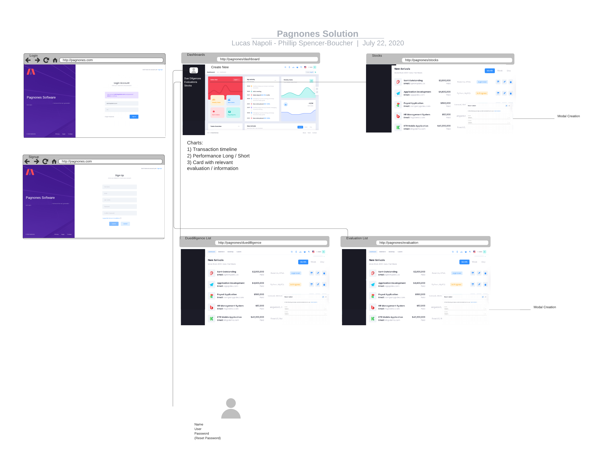
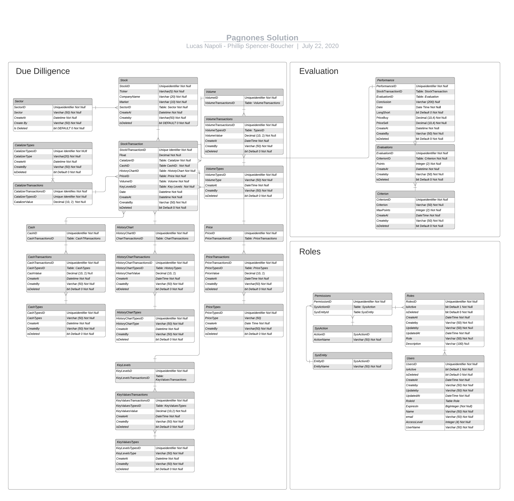

# Pagnones
McGill Database assignment to manage day-trade strategies
# Group Activity: Pagnones: Day-trade due dilligence solution

CCCS 330-784 Data Bases | Business Applications
Professor: Khattar Daou 
Student: Lucas Napoli / Phillip Spencer-Boucher 
Development: Pagnones System

# Deliverables:
1) Steps described to create the database based on the methodology presented in class
2) Scheme, Tables and Entities
3) Business Rules
4) Main wireframes embedded in this document
5) ER diagram embedded in this document

6) Scripts (Entire project can be opened in Visual Studio Code)
Attached .zip / or you can download the project in: https://github.com/lucasnapolilapenda/pagnones
   
# Abstract:
Day-trading business is a competitive sector where only less than 10% of the traders who perform day-trading transactions earn money. Emotions, "feeling" to wait for the "perfect moment", Lack of a strategy and not complying with the basic rules and limits are part of the reasons why traders lose money.

 A solution to follow a methodology, based on the stock drivers, seems to be necessary to improve the performance of future transactions. Additionally, a process to evaluate every trade and record all the historic transaction are a solution to develop better strategies and approaches before performing a day-trading transaction. 

# Steps:
## Purpose of the database

Create a functional database in order to track the strategy in a day-trading environment. Basically, the solution will record the due diligence before performing a trade transaction and then, when the transaction is closed, an evaluation will be recorded based on specific criteria (15 points): 
1) **Set-up:** correlation between the optimum setup and the conditions in the trade.
2) **Risk Management:** Comparison between the risk and maximum lost.
3) **Risk units vs rewards:** Compliance based on the rules. 
4) **Complete watch-list and trade planning**
5) **Buy real vs. plan**
6) **Emotional control**

In addition, this tool will have a Dashboard to summarize the most relevant information in charts, cards and tables.

## Entities
### Schemas
1) **Due Diligence:** tables related to the due diligence carried out before day-trading transaction (dd)
2) **Evaluation:** tables related to the "post-mortem" analysis (ev)
3) **Roles:** tables related to credentials and user management (roles)

## Generic User Stories, business rules and wireframes
### User Stories
1) As a user I want to create a user with password to use the tool
2) As a user I want to login into the solution with my username and password
3) As a user I want to load all the information related to a stock
4) As a user I want to complete the due diligence before starting a trade
5) As a user I want to evaluate how close I was according to the rules
6) As a user i want to see a summary of my transactions
7) As a user I want to see a list of my stocks
8) As a user I want to see a list of the due diligence
9) As a user I want to see a list of the evaluations
10) As a user I want to see the stock detail (by Stock)
11) As a user I want to see the evaluation detail (by evaluation)
12) As a user I want to see the due diligence detail (by due diligence)

### Business Rules
1) Logical deletion
2) One due diligence to one evaluation (one-to-one)
3) Control tables to track the date and responsible of the transaction
4) Limit of 15 points per criterion
   
### Wireframes  
 

### Tables
1) dd.Sector
2) dd.Stock
3) dd.StockTransaction
4) dd.CatalyzerTypes
5) dd.CatalyzerTransaction
6) dd.CashTypes
7) dd.CashTransactions
8) dd.Cash
9) dd.HistoryChartType
10) dd.HistoryChartTransaction
11) dd.HistoryChart
12) dd.KeyLevelsTypes
13) dd.KeyLevelsTransaction
14) dd.KeyLevels
15) dd.PriceTypes
16) dd.PriceTransactions
17) dd.Price
18) dd.VolumeTypes
19) dd.VolumeTransactions
20) dd.Volume
21) ev.Performance
22) ev.Evaluations
23) ev.Criterion
24) roles.Roles
25) role.Users
26) role.Permissions
27) role.SysAction
28) role.SysEntity

### ER diagram: to see the relation between entities and attributes
 Relations, entities and data types

## Additional Comments
1) Part of the business rules will be performed in the application layer (Spring / Amplify AWS)
2) All Scripts where organized in the following way:
- Database Creation (In our case we tested all the scripts in a pre-created Azure Database )
- Schema Creation based on the scripts presented in class
- Tables creation
- Foreign Key creation: i) Additional columns creation, ii) Constraints generation. We separated this phase to create the tables before implementing all the FK and columns/fields related to the FK
- 3) 

License and Rights
----
All the rights are reserved to Fernando Pagnone owner of all the intellectual property. The content of this document can not be distributed or shared without the written concent of Fernando Pagnone. 